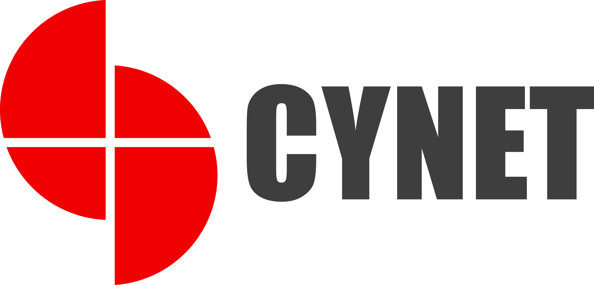

# BGV Audit Automation System

<div align="center">
  
  
  **Automated Invoice Auditing System for Background Verification Providers**
  
  [](https://www.python.org/)
  [](https://flask.palletsprojects.com/)
  [](https://firebase.google.com/docs/firestore)
</div>

## 📋 Overview

The BGV Audit Automation System is a web-based application designed to automatically audit invoices received from third-party Background Verification (BGV) providers. The system extracts line-item data from PDF invoices using deterministic, rule-based methods and flags financial discrepancies with high accuracy.

### Key Features

- ✅ **Zero Hallucination**: Deterministic extraction using rule-based logic (no LLMs)
- 🔍 **Automatic Provider Detection**: Identifies invoice provider from 15+ supported providers
- 📊 **Comprehensive Auditing**: Detects total mismatches, internal duplicates, and historical duplicates
- 🎯 **High Accuracy**: Provider-specific extraction templates for reliable data extraction
- 📄 **Multi-format Support**: Handles various PDF formats including scanned documents (with OCR fallback)
- 🔐 **Secure Authentication**: Google OAuth integration for user authentication
- 📱 **User-Friendly Interface**: Clean, responsive web interface with real-time processing feedback

## 🏗️ Architecture

### Core Components

- **Provider Extractors**: Rule-based PDF parsers for each provider format
- **Audit Engine**: Performs discrepancy detection (totals, duplicates)
- **Data Models**: Firestore-based storage for invoices and audit results
- **Web Interface**: Flask-based dashboard for upload and review

### Supported Providers

The system supports extraction and auditing for the following providers:

- CityMD
- Concentra
- Disa Global
- eScreen
- FastMed
- First Advantage
- HealthStreet
- InCheck
- Quest Diagnostics
- Scout Logic
- Summit Health
- Universal
- And more...

## 🚀 Getting Started

### Prerequisites

- Python 3.11+
- Google Cloud Firestore (for database)
- Google OAuth credentials (for authentication)
- Google Cloud Document AI API enabled (for OCR processing)

### Installation

1. **Clone the repository**
   ```bash
   git clone <repository-url>
   cd bgv-audit
   ```

2. **Install dependencies**
   ```bash
   pip install -r requirements.txt
   ```

3. **Set up environment variables**
   ```bash
   cp example.env .env
   # Edit .env with your configuration
   ```

4. **Configure Firebase**
   - Place your `firebase_auth.json` in the project root
   - Configure Firestore database

5. **Run the application**
   ```bash
   python src/app.py
   ```

### Docker Deployment

```bash
# Build and run with Docker Compose
docker-compose up -d
```

## 📖 Usage

1. **Login**: Authenticate using Google OAuth
2. **Upload Invoice**: Select a PDF file and choose the provider
3. **Processing**: The system automatically:
   - Identifies the provider (if not specified)
   - Extracts invoice data (invoice number, line items, totals)
   - Performs audit checks (totals, duplicates)
4. **Review Results**: View detailed audit report with pass/fail status

### Audit Checks Performed

1. **Total Mismatch**: Compares sum of line items against grand total
2. **Internal Duplicates**: Detects duplicate line items within the same invoice
3. **Historical Duplicates**: Flags items that have been billed in previous invoices

## 🛠️ Technology Stack

- **Backend**: Flask (Python)
- **Database**: Google Cloud Firestore
- **Authentication**: Google OAuth (via Authlib)
- **PDF Processing**: pdfplumber, PyPDF2
- **OCR**: Google Cloud Document AI (for scanned documents)
- **Frontend**: Bootstrap 5, Vanilla JavaScript
- **Deployment**: Docker, Gunicorn

## 📁 Project Structure

```
bgv-audit/
├── src/
│   ├── providers/          # Provider-specific extractors
│   ├── services/           # Business logic (audit, invoice processing)
│   ├── routes/            # Flask routes
│   ├── models.py          # Firestore data models
│   ├── static/            # CSS, JS, images
│   └── templates/         # HTML templates
├── pdfs/                  # Sample PDF invoices
├── requirements.txt       # Python dependencies
├── Dockerfile.prod        # Production Dockerfile
└── docker-compose.yml     # Docker Compose configuration
```

## 🔧 Development

### Adding a New Provider

1. Create a new provider class in `src/providers/`
2. Inherit from `BaseProvider`
3. Implement `identify()` and `extract()` methods
4. Add provider to `Provider` enum
5. Test with sample PDFs

### Running Tests

```bash
# Test provider extraction
python -m pytest tests/

# Test specific provider
python -c "from src.providers.your_provider import YourProvider; ..."
```

## 📝 License

Copyright © Cynet Health Inc. All rights reserved.

## 🤝 Contributing

This is an internal project. For questions or issues, please contact the development team.

## 📞 Support

For support, please contact the development team or create an issue in the project repository.

---
